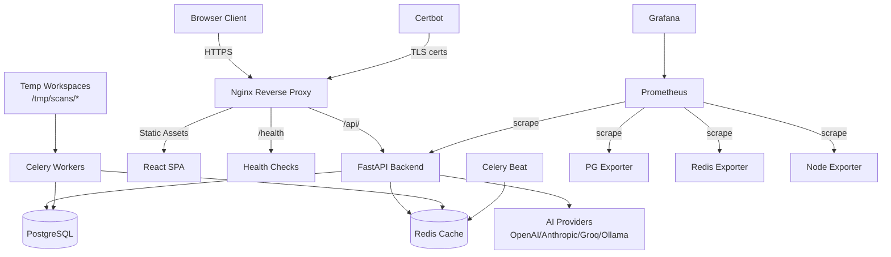

# CodeGuard AI — Production Deployment Guide

## Architecture Overview



## Environments

| Environment | Config File | Purpose |
|-------------|------------|---------|
| Development | `.env` | Local dev with hot-reload |
| Staging | `.env.staging` | Pre-production testing |
| Production | `.env.production` | Live deployment |

## Security Model

CodeGuard AI performs **static analysis only**. User code is parsed via AST and never executed, interpreted, or compiled. Temporary workspaces provide filesystem isolation between concurrent scans and are automatically deleted after completion.

## Prerequisites

- [ ] Python 3.11+ installed on server
- [ ] Node.js 18+ installed (for JS scanning)
- [ ] PostgreSQL 16+ running and accessible
- [ ] Redis 7+ running (recommended)
- [ ] Nginx installed for reverse proxy
- [ ] systemd for service management
- [ ] TLS certificates (Let's Encrypt or self-signed for dev)

## Deployment Steps

### 1. Server Preparation

```bash
# Install system dependencies
sudo apt update
sudo apt install -y python3 python3-pip python3-venv nodejs npm postgresql redis nginx

# Create application directory
sudo mkdir -p /opt/codeguard
sudo useradd -r -s /bin/false codeguard
sudo chown codeguard:codeguard /opt/codeguard
```

### 2. Application Setup

```bash
# Clone and configure
cd /opt/codeguard
git clone <repo-url> .
cp .env.production .env.production.local
# Edit ALL CHANGE_ME placeholders

# Generate JWT keys
bash backend/scripts/setup-tls.sh production

# Backend setup
cd backend
python3 -m venv venv
source venv/bin/activate
pip install -r requirements.txt
alembic upgrade head

# Frontend build
cd ../frontend
npm ci
npm run build
```

### 3. systemd Services

Create service files:

**`/etc/systemd/system/codeguard-api.service`**
```ini
[Unit]
Description=CodeGuard AI API
After=network.target postgresql.service redis.service
Wants=redis.service

[Service]
Type=simple
User=codeguard
Group=codeguard
WorkingDirectory=/opt/codeguard/backend
EnvironmentFile=/opt/codeguard/.env.production.local
ExecStart=/opt/codeguard/backend/venv/bin/uvicorn main:app --host 0.0.0.0 --port 8000 --workers 4
Restart=always
RestartSec=5
StandardOutput=journal
StandardError=journal

[Install]
WantedBy=multi-user.target
```

**`/etc/systemd/system/codeguard-celery.service`**
```ini
[Unit]
Description=CodeGuard AI Celery Worker
After=network.target postgresql.service redis.service
Wants=redis.service

[Service]
Type=simple
User=codeguard
Group=codeguard
WorkingDirectory=/opt/codeguard/backend
EnvironmentFile=/opt/codeguard/.env.production.local
ExecStart=/opt/codeguard/backend/venv/bin/celery -A app.tasks.celery_app worker --loglevel=info --concurrency=4
Restart=always
RestartSec=5
StandardOutput=journal
StandardError=journal

[Install]
WantedBy=multi-user.target
```

**`/etc/systemd/system/codeguard-celery-beat.service`**
```ini
[Unit]
Description=CodeGuard AI Celery Beat Scheduler
After=network.target redis.service
Wants=redis.service

[Service]
Type=simple
User=codeguard
Group=codeguard
WorkingDirectory=/opt/codeguard/backend
EnvironmentFile=/opt/codeguard/.env.production.local
ExecStart=/opt/codeguard/backend/venv/bin/celery -A app.tasks.celery_app beat --loglevel=info
Restart=always
RestartSec=5
StandardOutput=journal
StandardError=journal

[Install]
WantedBy=multi-user.target
```

```bash
# Enable and start services
sudo systemctl daemon-reload
sudo systemctl enable codeguard-api codeguard-celery codeguard-celery-beat
sudo systemctl start codeguard-api codeguard-celery codeguard-celery-beat
```

### 4. Nginx Configuration

```nginx
server {
    listen 443 ssl http2;
    server_name codeguard.example.com;

    ssl_certificate     /opt/codeguard/certs/fullchain.pem;
    ssl_certificate_key /opt/codeguard/certs/tls_private.key;

    # Security headers
    add_header X-Content-Type-Options nosniff;
    add_header X-Frame-Options DENY;
    add_header X-XSS-Protection "1; mode=block";

    # API reverse proxy
    location /api/ {
        proxy_pass http://127.0.0.1:8000;
        proxy_set_header Host $host;
        proxy_set_header X-Real-IP $remote_addr;
        proxy_set_header X-Forwarded-For $proxy_add_x_forwarded_for;
        proxy_set_header X-Forwarded-Proto $scheme;
        proxy_read_timeout 300s;
    }

    # Health endpoints
    location /health {
        proxy_pass http://127.0.0.1:8000;
    }
    location /ready {
        proxy_pass http://127.0.0.1:8000;
    }

    # Frontend static files
    location / {
        root /opt/codeguard/frontend/dist;
        try_files $uri $uri/ /index.html;
    }
}

server {
    listen 80;
    server_name codeguard.example.com;
    return 301 https://$host$request_uri;
}
```

### 5. Verification

```bash
# Check service status
sudo systemctl status codeguard-api
sudo systemctl status codeguard-celery

# Health check
curl -f http://localhost:8000/health

# Workspace health check
curl -f http://localhost:8000/api/v1/scanner/workspace-health
```

## Rolling Deployment

```bash
# Deploy latest code
bash deploy/deploy.sh

# Skip backup (if recently backed up)
bash deploy/deploy.sh --skip-backup

# Skip migrations (if already run)
bash deploy/deploy.sh --skip-migrate

# Rollback
bash deploy/deploy.sh --rollback
```

## Security Checklist

- [x] HTTPS enforced (Nginx TLS termination)
- [x] JWT RS256 with asymmetric keys
- [x] Strong secrets (no placeholder values)
- [x] Database password not in connection URL
- [x] Redis password configured
- [x] CORS restricted to production domain
- [x] Rate limiting enabled (60 req/min)
- [x] Account lockout (5 attempts → 15 min)
- [x] Security headers set (CSP, X-Frame-Options, etc.)
- [x] Static analysis safety model (no code execution)
- [x] Ephemeral workspaces (auto-deleted after scan)

## Troubleshooting

### Check Configuration

```bash
cd /opt/codeguard/backend
source venv/bin/activate
python -c "from app.core.config import settings; print(settings.DATABASE_URL)"
```

### Check Database Connectivity

```bash
psql -h localhost -U codeguard_user -d codeguard -c "SELECT 1;"
```

### Check Service Logs

```bash
sudo journalctl -u codeguard-api -n 100
sudo journalctl -u codeguard-celery -n 100
```

### Check Resource Usage

```bash
top -o %MEM | head -20
df -h  # Disk space (including /tmp for workspaces)
```