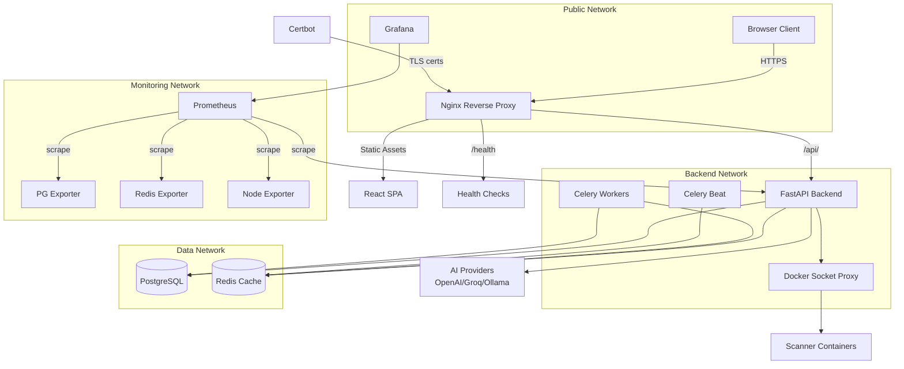
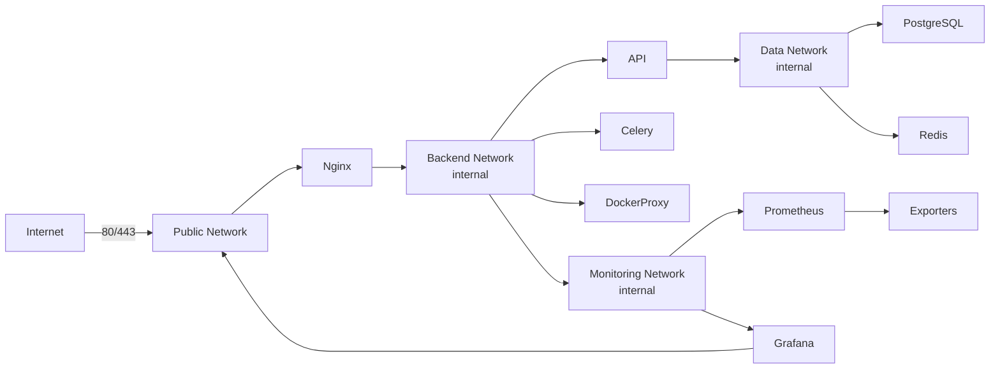
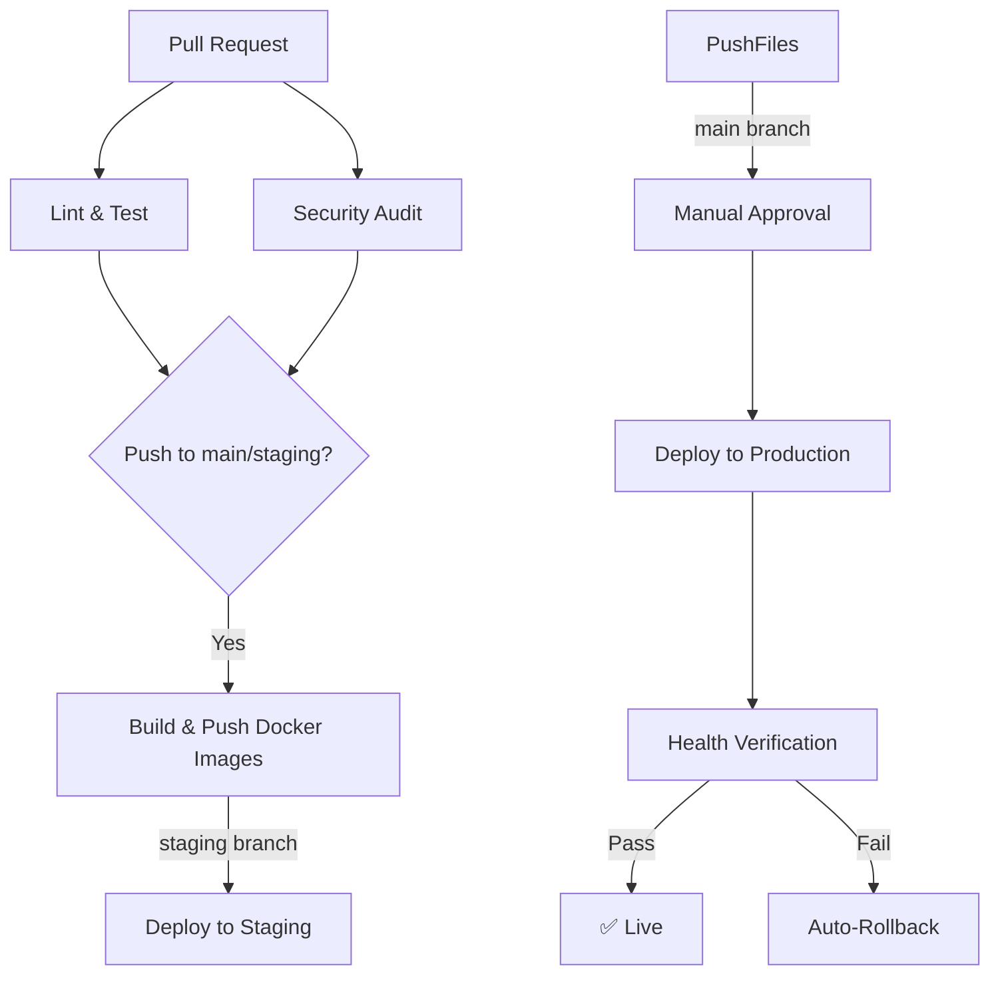

# CodeGuard AI — Production Deployment Guide

## Architecture Overview



## Quick Start

```bash
# 1. Clone and configure
cp .env.example .env.production
# Edit .env.production with real values

# 2. Generate certificates
make certs-generate

# 3. Start production stack
make up ENV=production

# 4. Verify health
make health-verbose
```

## Deployment Checklist

### Pre-Deployment
- [ ] All environment variables set in `.env.production`
- [ ] Passwords changed from placeholder values (use `python3 -c "import secrets; print(secrets.token_urlsafe(48))"`)
- [ ] JWT keys generated (`make certs-generate`)
- [ ] TLS certificates configured (`./deploy/cert-manager.sh setup` or `./deploy/cert-manager.sh self-signed`)
- [ ] Domain DNS records pointing to server IP
- [ ] Firewall rules: allow 80, 443; deny 5432, 6379, 8000, 9090
- [ ] Docker and Docker Compose v2 installed on server
- [ ] `.env.production` contains NO placeholder `CHANGE_ME` values

### Security
- [ ] `JWT_ALGORITHM=RS256` (not HS256)
- [ ] `DEBUG=false`
- [ ] `ENVIRONMENT=production`
- [ ] Database ports not exposed externally
- [ ] Redis password set
- [ ] CORS origins set to specific domains
- [ ] `ALLOWED_HOSTS` set to specific domains
- [ ] Rate limiting enabled (60 req/min default)
- [ ] Security headers configured in nginx
- [ ] HSTS enabled (Strict-Transport-Security)
- [ ] Gitleaks pre-commit hook installed

### Monitoring
- [ ] Prometheus scraping all services
- [ ] Grafana dashboards provisioned
- [ ] Alert rules configured
- [ ] Log aggregation configured (json-file driver with rotation)
- [ ] Health check endpoints responding (`/api/v1/health`, `/api/v1/ready`)

### Backup
- [ ] Database backup cron configured (`make db-backup` or `./deploy/db-backup.sh`)
- [ ] Backup retention policy set (default: 30 days)
- [ ] S3 upload tested (if using `--upload` flag)
- [ ] Backup restore tested (`./deploy/db-restore.sh --dry-run`)

## Environment Variables Reference

| Category | Variable | Required | Default | Description |
|----------|----------|----------|---------|-------------|
| App | `PROJECT_NAME` | No | CodeGuard AI | Application name |
| App | `ENVIRONMENT` | Yes | development | `production`, `staging`, or `development` |
| App | `DEBUG` | Yes | false | Enable debug mode |
| App | `LOG_LEVEL` | No | INFO | DEBUG, INFO, WARNING, ERROR, CRITICAL |
| Database | `DATABASE_URL` | Yes | sqlite | PostgreSQL connection string |
| Database | `POSTGRES_PASSWORD` | Yes | — | Strong random password |
| Database | `DATABASE_STATEMENT_TIMEOUT` | No | 30 | Query timeout in seconds |
| Redis | `REDIS_URL` | Yes | — | Redis connection string |
| Redis | `REDIS_PASSWORD` | Yes | — | Strong random password |
| Auth | `JWT_ALGORITHM` | Yes | RS256 | RS256 (recommended) or HS256 |
| Auth | `JWT_PRIVATE_KEY_PATH` | Yes* | — | Path to RSA private key |
| Auth | `JWT_PUBLIC_KEY_PATH` | Yes* | — | Path to RSA public key |
| Auth | `JWT_ACCESS_TOKEN_EXPIRE_MINUTES` | No | 30 | Access token lifetime |
| Security | `ALLOWED_HOSTS` | Yes | * | Comma-separated domain names |
| Security | `CORS_ORIGINS` | Yes | localhost | Comma-separated HTTPS URLs |
| AI | `OPENAI_API_KEY` | No | — | OpenAI API key |
| AI | `GROQ_API_KEY` | No | — | Groq API key |
| Email | `SMTP_HOST` | No | localhost | SMTP server for notifications |
| Monitoring | `GRAFANA_ADMIN_PASSWORD` | Yes | — | Grafana admin password |

*Required only when `JWT_ALGORITHM=RS256`

## Three-Environment Strategy

| Environment | Compose Files | Purpose |
|-------------|--------------|---------|
| Development | `docker-compose.yml` | Local dev with hot-reload |
| Staging | `docker-compose.yml` + `docker-compose.staging.yml` | Pre-production testing |
| Production | `docker-compose.yml` + `docker-compose.prod.yml` | Live deployment |

### Starting each environment:
```bash
# Development (hot-reload, debug)
make dev

# Staging
make staging

# Production
make up ENV=production
```

## Network Architecture



**Key security principle**: Only `nginx` and `grafana` are on the `public` network. All database/cache connections are on `internal: true` networks that block external access.

## CI/CD Pipeline



The CI/CD pipeline (`.github/workflows/ci.yml`) runs:
1. **Backend lint + test** — ruff, pytest, coverage
2. **Frontend lint + build** — ESLint, vitest, vite build
3. **Security audit** — bandit, pip-audit, npm audit, gitleaks
4. **Docker build** — Multi-arch images pushed to GHCR
5. **Deploy staging** — Automatic on `staging` branch
6. **Deploy production** — Requires manual approval, with auto-rollback

## Health Checks

| Endpoint | Purpose | Expected Response |
|----------|---------|-------------------|
| `GET /health` | Liveness probe | `{"status": "healthy", "version": "1.0.0"}` |
| `GET /api/v1/health` | API liveness (behind nginx) | Same as above |
| `GET /api/v1/ready` | Readiness (checks DB + Redis) | `{"status": "healthy", "checks": {"database": "ok", "redis": "ok"}}` |
| `GET /health` (nginx) | Frontend health | `{"status": "healthy"}` |

## Backup & Disaster Recovery

### Automated Backups
```bash
# One-time manual backup
make db-backup

# Restore from backup
./deploy/db-restore.sh --latest

# Restore specific backup
./deploy/db-restore.sh backups/codeguard_20250531_120000.sql.gz

# Dry run (no changes)
./deploy/db-restore.sh --latest --dry-run
```

### Recommended Backup Schedule (crontab)
```cron
# Daily backup at 2 AM, keep 30 days, upload to S3
0 2 * * * cd /opt/codeguard && ./deploy/db-backup.sh --upload --retention=30 >> /var/log/codeguard-backup.log 2>&1
```

### Rollback Procedure
```bash
# Method 1: Makefile
make deploy-rollback

# Method 2: Deploy script
./deploy/deploy.sh --rollback

# Method 3: Manual
docker compose -f docker-compose.yml -f docker-compose.prod.yml down api
docker compose -f docker-compose.yml -f docker-compose.prod.yml up -d api
```

## TLS Certificate Management

```bash
# Initial Let's Encrypt certificate
DOMAIN=codeguard.example.com EMAIL=admin@example.com ./deploy/cert-manager.sh setup

# Renew certificates (run via cron)
./deploy/cert-manager.sh renew

# Self-signed for development/staging
./deploy/cert-manager.sh self-signed

# Check certificate expiry
./deploy/cert-manager.sh check
```

### Auto-renewal cron (add to server crontab):
```cron
0 0 * * * /opt/codeguard/deploy/cert-manager.sh renew >> /var/log/codeguard-cert-renew.log 2>&1
```

## Monitoring Stack

- **Prometheus** — Metrics collection (port 9090, internal only)
- **Grafana** — Dashboards and visualization (port 3001)
- **PostgreSQL Exporter** — Database metrics (port 9187, internal)
- **Redis Exporter** — Cache metrics (port 9121, internal)
- **Node Exporter** — System metrics (port 9100, internal)

### Key Metrics to Monitor
- HTTP request rate and error rate (5xx percentage)
- p50/p95/p99 API latency
- PostgreSQL connection count and saturation
- Redis memory usage and hit rate
- Container memory/CPU usage
- Celery task queue depth
- Disk space usage

### Alert Rules (already configured)
- High 5xx error rate (>5% over 5 min)
- High API latency (p95 > 2s over 5 min)
- Container restarts
- High memory usage (>85%)
- Low disk space (<10%)
- Scan queue backlog (>50 pending)
- PostgreSQL connection saturation
- Redis memory high

## Recommended Hosting Options

### Production Grade (managed services)

| Provider | Compute | Database | Cache | Cost Est. |
|----------|---------|----------|-------|-----------|
| **AWS** | ECS Fargate | RDS PostgreSQL | ElastiCache Redis | $200-500/mo |
| **GCP** | Cloud Run | Cloud SQL PostgreSQL | Memorystore Redis | $150-400/mo |
| **DigitalOcean** | App Platform | Managed DB | Managed Redis | $100-300/mo |
| **Railway** | Containers | PostgreSQL | Redis | $50-200/mo |
| **Render** | Web Services | PostgreSQL | Redis | $50-200/mo |

### Budget-Friendly (single VPS)
- Hetzner Cloud CPX21 (~€15/mo) — 4 vCPU, 8GB RAM, 80GB disk
- DigitalOcean Droplet ($24/mo) — 4 vCPU, 8GB RAM
- All services on one server using this docker-compose setup

### Key Considerations
1. **PostgreSQL** — Use managed (RDS/Cloud SQL) for automated backups and failover
2. **Redis** — Use managed for persistence and replication
3. **Container Registry** — GHCR (free for public) or ECR/Artifact Registry
4. **CDN** — CloudFront or Cloudflare for static assets
5. **SSL** — Let's Encrypt with auto-renewal or Cloudflare termination

## Production Optimization Checklist

### Backend (FastAPI)
- [x] Multi-worker uvicorn (`--workers 4`) with `uvloop` + `httptools`
- [x] Connection pooling (pool_size=10, max_overflow=20, pool_recycle=3600)
- [x] Statement timeout (30s) to prevent runaway queries
- [x] Structured JSON logging via structlog
- [x] Prometheus metrics via `prometheus-fastapi-instrumentator`
- [x] Domain exception middleware with consistent error envelope
- [x] Rate limiting on auth endpoints (3/min)
- [x] Health and readiness probes

### Frontend (React + Nginx)
- [x] Vite production build with tree-shaking and code splitting
- [x] Console stripping in production builds
- [x] Hidden source maps for error tracking
- [x] Nginx gzip compression
- [x] Static asset caching (1-year immutable for hashed filenames)
- [x] Security headers (HSTS, CSP, X-Frame-Options)
- [x] Rate limiting on API and auth endpoints
- [x] Connection keepalive to backend

### Infrastructure
- [x] Multi-stage Docker builds (minimal runtime images)
- [x] Non-root user in all containers
- [x] Network isolation (4 separate networks)
- [x] Resource limits on all containers
- [x] Log rotation (json-file driver, 10MB max, 5 files)
- [x] Health checks on all services
- [x] Docker socket proxy (no direct socket access)

## Troubleshooting

### API won't start
```bash
make logs-api
# Check: DATABASE_URL, REDIS_URL, JWT keys
docker compose exec api python -c "from app.core.config import settings; print(settings.DATABASE_URL)"
```

### Database connection refused
```bash
docker compose exec postgres pg_isready -U codeguard_user
# Check: POSTGRES_PASSWORD matches between .env and DATABASE_URL
```

### Certificate errors
```bash
./deploy/cert-manager.sh check
openssl s_client -connect codeguard.example.com:443 -servername codeguard.example.com </dev/null
```

### High memory usage
```bash
docker stats --no-stream
# Check monitoring dashboards in Grafana
```

### Slow responses
```bash
# Check API metrics
curl -sf http://localhost:8000/api/v1/health | python3 -m json.tool
# Check nginx logs
docker compose logs frontend --tail=100 | grep -E '(4\d{2}|5\d{2})'
```